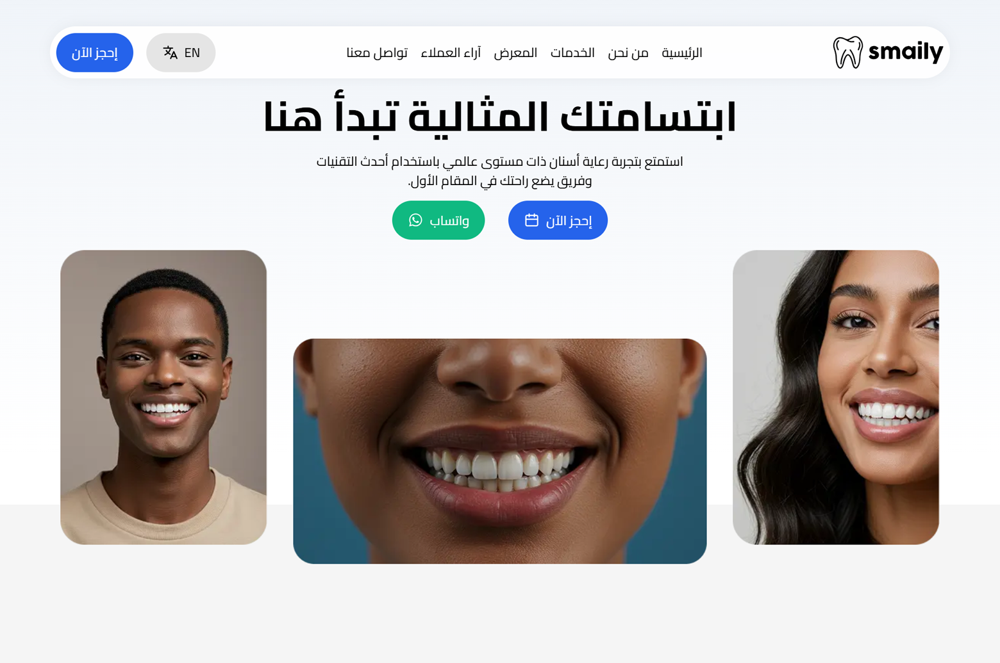

# Smaily Dental Clinic Website

A modern, multilingual dental clinic website built with Next.js, React, and Tailwind CSS.

---

## 🔗 Live Website

[https://smaily.vercel.app](https://smaily.vercel.app)

---

## 🌍 Screenshots

**English Version**


**Arabic Version**



---

## 🚀 Getting Started

1. **Install dependencies:**
   ```bash
   npm install
   ```

2. **Run the development server:**
   ```bash
   npm run dev
   ```

3. Open [http://localhost:3000](http://localhost:3000) in your browser.

---

## 🛠️ Tech Stack

- [Next.js 15](https://nextjs.org/)
- [React 19](https://react.dev/)
- [Tailwind CSS 4](https://tailwindcss.com/)
- [next-intl](https://github.com/amannn/next-intl) (i18n)
- ESLint

---

## 📁 Project Structure

- `src/components`: UI components
- `src/app`: App pages
- `messages/`: Translation files
- `public/`: Static assets (images, icons)

---

## 🌐 Languages

- English
- Arabic

Switch between languages using the language button in the navbar.

---

## 🤝 Contributing

Contributions are welcome! Please open issues or submit pull requests.

---

## 📄 License

This project is for personal use only.

---